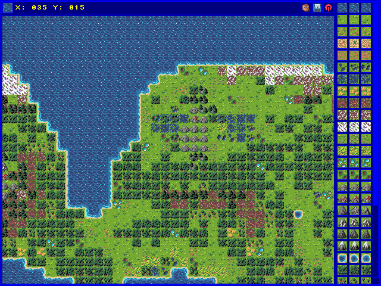
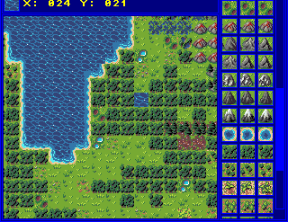

# Settle the World - Map Editor

Simple map editor for the Amiga strategy game [Settle the World](https://theotheoderich.itch.io/settle-the-world).

## Copyright notice

The stw_map_editor and exdev-gfx library are copyright by Andre "eliot" Geisler (andre@exdev.de).  
The stw_map_editor uses assets from the game Settle the World.  
These assets are copyright by Christian "theotheoderich" Wiegel.  

## Goals

- Implement a map editor for "Settle the World"
- Support load, modify and store maps 
- Support different target platforms
  - AmigaOs 3.x (68k, RTG and AGA)
  - MorphOs 3.x (ppc)
  - MacOs X (arm64)
  - Ubuntu Linux (amd64, arm64)
- Implement in C99
- Few dependencies as possible

## Screenshots

Amiga 4000T RTG:  


Amiga 1200 AGA:  


## Usage

see: [stw_map_editor.readme](dist/stw_map_editor.readme)

## Checkout

```shell
    git clone git@github.com:eliot-exdev/stw-map-editor.git
    cd stw-map-editor
    git submodule update --init
```

## Dependencies

- [vbcc](http://sun.hasenbraten.de/vbcc) and [NDK](https://www.hyperion-entertainment.com/index.php/downloads?view=download&layout=form&file=126) (for AmigaOs build)
- [GCC and SDK](https://www.morphos-team.net/files/sdk-20230510.lha) (for MorphOs build)
- [c2p library](https://aminet.net/package/dev/misc/c2plib) (for AGA)

## Build

### Compile for MacOs X and Linux
```shell
    mkdir build
    cd build
    cmake ../ -DCMAKE_BUILD_TYPE=Release
    cmake --build . --parallel 4
```

### Cross compile for MorphOs on linux
```shell
    mkdir build-mos
    cd build-mos
    cmake ../ -DCMAKE_BUILD_TYPE=Release -DCMAKE_TOOLCHAIN_FILE=../exdev-gfx/cmake/morphos-ppc.toolchain
    cmake --build . --parallel 4
```

## Todo

- Implement "Variance" button/functionality
- Implement "Undo/Redo" button/functionality
- Finish stw_map_editor.readme
